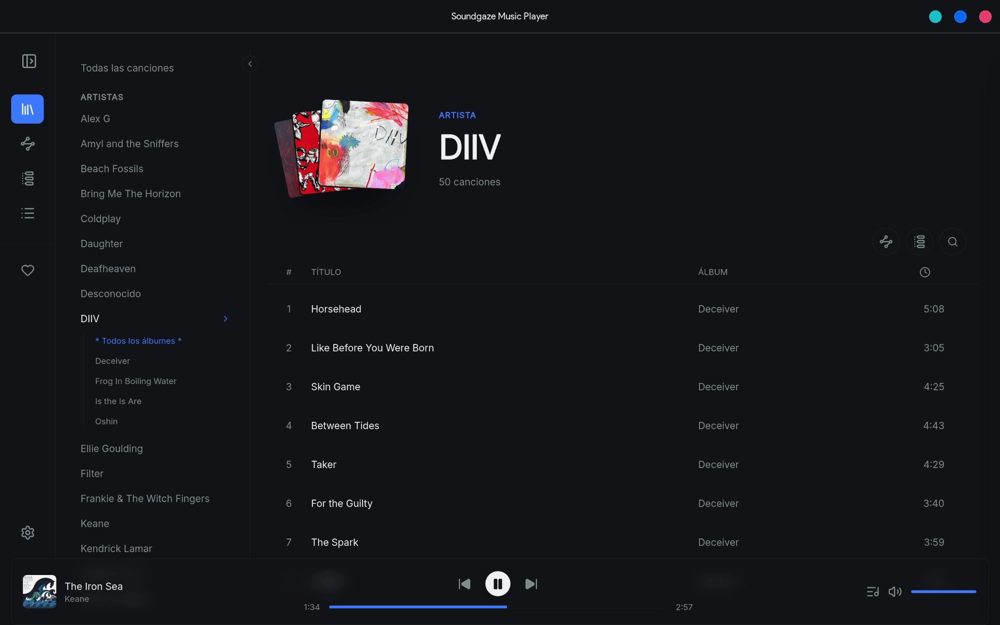
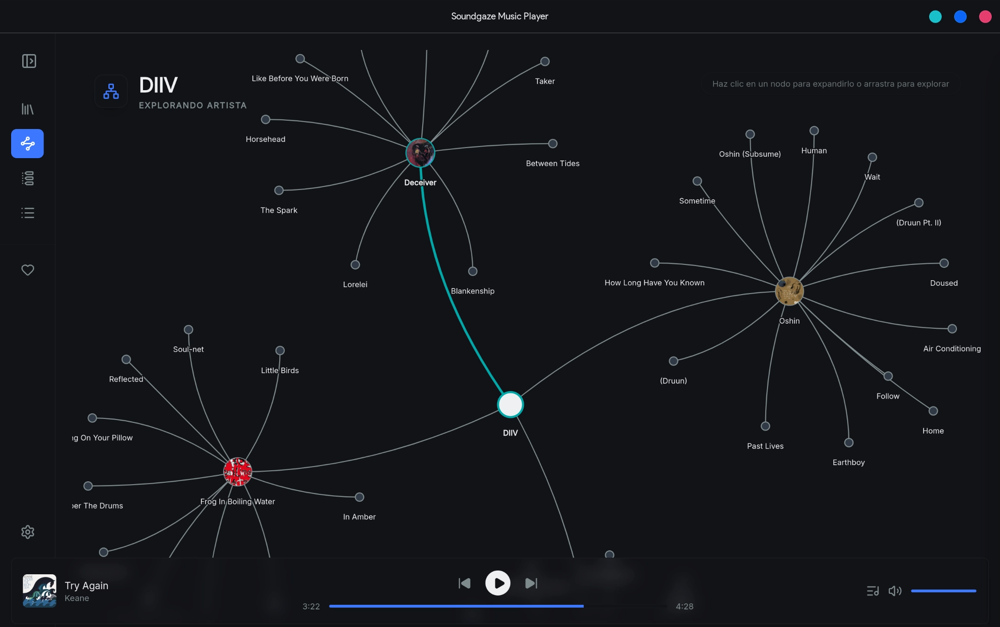
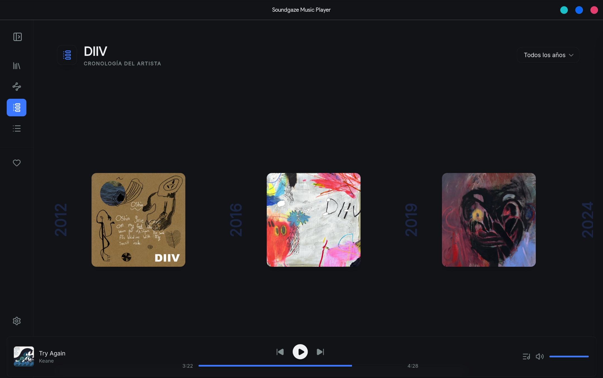
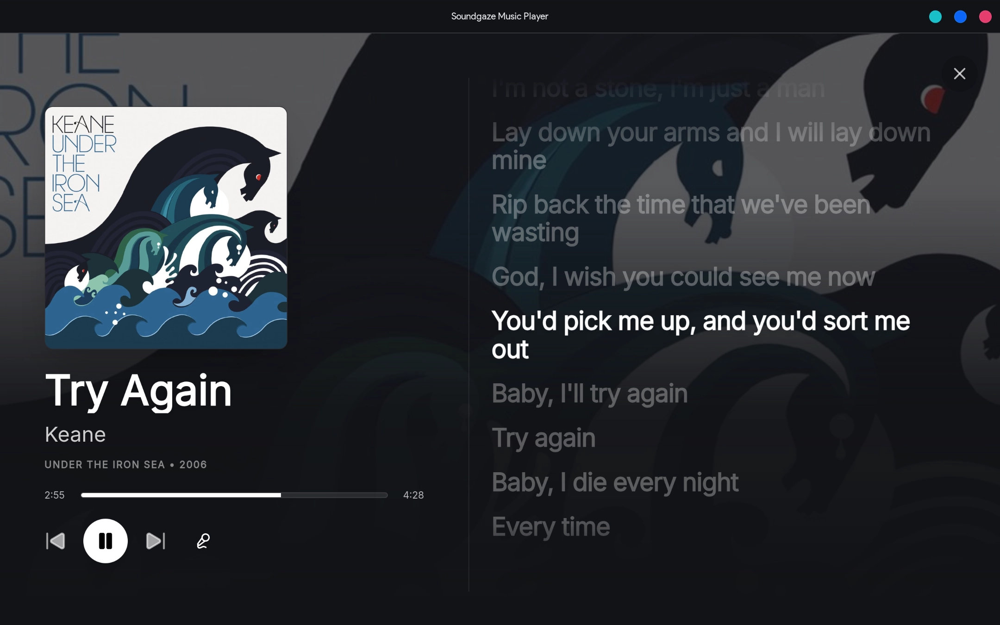

# Soundgaze Music Player (EN) 🎶

A modern, lightweight, and highly visual client for **Music Player Daemon (MPD)**, built with web technologies and the power of Rust. Designed to offer an immersive experience when exploring music collections of any size.

 

## ✨ Key Features

* **Unique Exploratory Views:**
  * **Interactive Graph:** Explore your library as a network of nodes with real-time physics. Discover visual connections between your favorite artists and their albums.
  * **Musical Timeline:** Travel through the decades with a chronological view of all your albums.
* **Native MPD Integration:** Full control over the audio daemon (playback, queue, ReplayGain, Crossfade) with zero latency.
* **MPRIS Support:** Seamless native integration with your desktop environment's media controls (ideal for KDE Plasma and other Linux ecosystems).
* **High Performance:** Powered by **IndexedDB** to handle catalogs of hundreds of thousands of tracks without blocking the UI.
* **Deep Customization:** Support for light/dark mode, dynamic themes that adapt to album art, and built-in schemes inspired by desktop environments (Breeze, Nord, Arc, Yaru, etc.).
* **Internationalization:** Available in multiple languages.

## ⚠️ Prerequisites

Soundgaze is a client, **not** a standalone playback engine. To use it, you need to have **Music Player Daemon (MPD)** installed and configured.

1. Install MPD on your system (e.g., `sudo apt install mpd` or `sudo pacman -S mpd`).
2. Make sure your `music_directory` is configured in your `mpd.conf` file.
3. Start the local or remote service.

## 🚀 Installation

### Direct Download
You can download the compiled installers for your operating system from the [Releases](../../releases) section.

### Build from source
If you prefer to compile Soundgaze yourself:

1. Clone the repository:
   git clone https://github.com/ojag95/soundgaze-music-player

   cd soundgaze-music-player
   
2. Install Node dependencies:
   npm install
   
3. Build the application with Tauri (requires Rust to be installed):
   npm run tauri build
   
   *The final executable will be located in `src-tauri/target/release/bundle/`.*

## 🛠️ Tech Stack

Soundgaze achieves its performance and aesthetics by combining:
* **Frontend:** React, TypeScript, Zustand (State management), Tailwind CSS.
* **Backend/System:** Tauri (Rust) for lightweight binaries and safe native operations.
* **Networks:** `vis-network` for graph canvas rendering.
* **Data:** `idb-keyval` (IndexedDB) for high-performance asynchronous persistence.

## 📸 Gallery

| Graphical View | Timeline | Lyrics & Immersion |
|:---:|:---:|:---:|
|  |  |  |

## 📝 License

Distributed under the GNU GPLv3 License. See the `LICENSE` file for more information.

Copyright (C) 2026 Oscar Josué Avila Gutierrez

# Soundgaze Music Player (ES) 🎶

Un cliente moderno, ligero y altamente visual para **Music Player Daemon (MPD)**, construido con tecnologías web y la potencia de Rust. Diseñado para ofrecer una experiencia inmersiva al explorar colecciones musicales de cualquier tamaño.

 

## ✨ Características Principales

* **Vistas Exploratorias Únicas:**
  * **Grafo Interactivo:** Explora tu biblioteca como una red de nodos con físicas en tiempo real. Descubre conexiones visuales entre tus artistas favoritos y sus albums.
  * **Línea de Tiempo Musical:** Viaja a través de las décadas con una vista cronológica de todos tus álbumes.
* **Integración Nativa con MPD:** Control total sobre el demonio de audio (reproducción, cola, ReplayGain, Crossfade) con latencia cero.
* **Soporte MPRIS:** Integración nativa perfecta con los controles multimedia de tu entorno de escritorio (ideal para KDE Plasma y otros ecosistemas Linux).
* **Alto Rendimiento:** Uso de **IndexedDB** para manejar catálogos de cientos de miles de pistas sin bloquear la interfaz.
* **Personalización Profunda:** Soporte para modo claro/oscuro, temas dinámicos que se adaptan a la carátula del álbum, y esquemas integrados inspirados en entornos de escritorio (Breeze, Nord, Arc, Yaru, etc.).
* **Internacionalización:** Disponible en múltiples idiomas.

## ⚠️ Prerrequisitos

Soundgaze es un cliente, **no** un motor de reproducción autónomo. Para utilizarlo, necesitas tener instalado y configurado **Music Player Daemon (MPD)**.

1. Instala MPD en tu sistema (ej. `sudo apt install mpd` o `sudo pacman -S mpd`).
2. Asegúrate de tener configurado tu `music_directory` en el archivo `mpd.conf`.
3. Inicia el servicio local o remoto.

## 🚀 Instalación

### Descarga Directa
Puedes descargar los instaladores compilados para tu sistema operativo desde la sección de [Releases](../../releases).

### Compilación desde el código fuente
Si prefieres compilar Soundgaze tú mismo:

1. Clona el repositorio:
   git clone https://github.com/ojag95/soundgaze-music-player

   cd soundgaze
   
2. Instala las dependencias de Node:
   npm install
   
3. Compila la aplicación con Tauri (requiere tener Rust instalado):
   npm run tauri build
   
   *El ejecutable final se encontrará en `src-tauri/target/release/bundle/`.*

## 🛠️ Stack Tecnológico

Soundgaze logra su rendimiento y estética combinando:
* **Frontend:** React, TypeScript, Zustand (Manejo de estado), Tailwind CSS.
* **Backend/Sistema:** Tauri (Rust) para binarios ligeros y operaciones nativas seguras.
* **Redes:** `vis-network` para el renderizado del lienzo de grafos.
* **Datos:** `idb-keyval` (IndexedDB) para persistencia asíncrona de alto rendimiento.

## 📸 Galería

| Vista Gráfica | Línea de Tiempo | Letras e Inmersión |
|:---:|:---:|:---:|
|  |  |  |

## 📝 Licencia

Distribuido bajo la Licencia GNU GPLv3. Consulta el archivo `LICENSE` para más información.

Copyright (C) 2026 Oscar Josué Avila Gutierrez